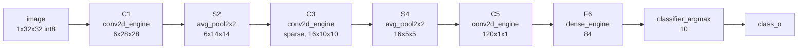

# LeNet-5 ASIC Convolution Accelerator

[](https://github.com/3more102/lenet5-asic-accelerator/actions/workflows/ci.yml)
[](LICENSE)
[](rtl/)
[](docs/PPA.md)

A verified, technology-independent RTL implementation of the LeNet-5 inference
datapath, built as a semi-custom ASIC starting point. Every testbench checks the
SystemVerilog against a bit-exact Python oracle — none of them assert
hand-written expected values.

- the canonical 1998 LeNet-5 architecture, including sparse C3 connectivity;
- a NumPy floating-point model of C1/S2/C3/S4/C5/F6/RBF;
- a bit-exact signed-int8 convolution golden model;
- synthesizable SystemVerilog for a 5-lane row-stationary convolution PE;
- a configurable, memory-backed 5x5 convolution reference engine;
- a full `lenet5_top` that sequences C1→S2→C3→S4→C5→F6→classifier;
- self-checking RTL tests with generated golden vectors and backpressure;
- real area/timing/power against the sky130hd PDK for every storage-free
  arithmetic block, plus semi-custom implementation guidance for the rest.

The RTL was written technology-independent, but it is no longer PPA-blind:
**[`docs/PPA.md`](docs/PPA.md)** has real gate-level area, static-timing
slack, and power against **sky130hd** for `conv5x5_pe` and its four sibling
leaf blocks — pre-layout (synthesis + STA, no place-and-route yet; see that
doc for exactly what is and is not covered).

## Pipeline



One `conv2d_engine` instance is resource-shared across C1, C3, and C5; one
`avg_pool2x2_stream` across S2 and S4. The reusable physical-design block is
`conv5x5_pe` — five signed multipliers evaluating one kernel row per accepted
cycle, with a stationary int32 accumulator. See
[`docs/ARCHITECTURE.md`](docs/ARCHITECTURE.md) for dataflow rationale and the
fixed-point contract.

## Verification status

All ten regression stages pass under Icarus Verilog 12.0 and Siemens
ModelSim; generic synthesis passes under Yosys.

| Check | What it proves |
|---|---|
| `golden.test_golden` | quantization corner cases + the full floating LeNet-5 shape chain |
| `lint` | SystemVerilog elaboration of the complete RTL list, three top modules |
| `tb_conv5x5_pe` | PE accumulation, bias injection, requantization, output backpressure |
| `tb_lenet5_c3_connectivity` | the exact 60 canonical C3 input-map connections |
| `tb_conv2d_engine` | 48 engine outputs vs the Python int8 oracle |
| `tb_avg_pool2x2_stream` | 12 pooling outputs vs the oracle |
| `tb_dense_engine` | 5 F6 outputs vs the oracle |
| `tb_classifier_argmax` | predicted class vs the oracle |
| `tb_classifier_argmax_tie` | tied max score resolves to the lowest index |
| `tb_lenet5_top` | full 32x32 image end-to-end vs `deploy_forward_int8` |

## Nominal cost

| Metric | Value |
|---|---:|
| Canonical trainable parameters | 60,000 |
| C3 input-map connections | 60 (not 96) |
| MACs across C1/C3/C5 | 315,600 |
| PE row cycles across C1/C3/C5 | 63,120 |
| End-to-end measured cycles (`lenet5_top`, ModelSim) | 202,866 |

The end-to-end figure includes every per-layer weight/bias ROM load and is a
non-overlapped, resource-shared sequencing baseline — not a throughput target.
Overlapping ROM loads with the previous stage's compute is the obvious first
optimization.

## Quick start

Requirements:

- Python 3.10+ and NumPy
- Icarus Verilog 11+ (`iverilog`, `vvp`) or Siemens ModelSim/Questa
- optional Yosys for generic synthesis

```bash
sudo apt-get install -y iverilog yosys python3-numpy
```

Run the complete open-source regression:

```bash
make regression
```

Run generic synthesis of the arithmetic leaf blocks:

```bash
make synth
```

Run real sky130hd area/timing/power (needs `yosys` and `openroad` on `PATH`;
see [`docs/PPA.md`](docs/PPA.md) for what it produces):

```bash
make ppa
```

Run in ModelSim/Questa:

```bash
python golden/generate_vectors.py
vsim -do scripts/modelsim.do
```

On Windows PowerShell, from the project folder:

```powershell
.\scripts\run_modelsim.ps1
```

Waveforms are written to `results/conv2d_engine.vcd` by Icarus and to
`results/conv2d_engine.wlf` by ModelSim.

## Repository map

| Path | Purpose |
|---|---|
| `rtl/conv5x5_pe.sv` | Primary semi-custom arithmetic block |
| `rtl/conv2d_engine.sv` | Memory-backed reference scheduler and engine |
| `rtl/lenet5_c3_connectivity.sv` | Exact canonical C3 sparse table |
| `rtl/lenet5_top.sv` | Full pipeline, resource-shared across layers |
| `golden/lenet5.py` | Full canonical floating-point network |
| `golden/quantized_conv.py` | Bit-exact int8 RTL oracle |
| `golden/deploy.py` | End-to-end int8 deployment model the RTL implements |
| `tb/` | Self-checking SystemVerilog tests |
| `docs/ARCHITECTURE.md` | Dataflow, performance, and LeNet mapping |
| `docs/INTERFACES.md` | Cycle-level and tensor-layout contracts |
| `docs/SEMICUSTOM_FLOW.md` | RTL-to-GDS plan and sign-off checklist |
| `docs/VERIFICATION_PLAN.md` | Verification scope and remaining work |
| `docs/PPA.md` | Real sky130hd area/timing/power, pre-layout |
| `synth/` | Generic synthesis scripts and 100 MHz sample SDC |
| `asic/openroad/` | OpenROAD Flow Scripts configuration, run script, toolchain patches |
| `asic/sta/` | Real sky130hd synthesis + OpenSTA sweep (`make ppa`) |

## Important project boundary

The supplied vectors use **deterministic random values to verify arithmetic;
they are not trained MNIST weights**. No accuracy number is claimed anywhere in
this repository. A classifier tapeout additionally requires training,
quantization-aware calibration, exported weights/scales, SRAM integration, DFT,
physical implementation, and PVT sign-off.

## Key references

- Y. LeCun, L. Bottou, Y. Bengio, and P. Haffner,
  [“Gradient-Based Learning Applied to Document Recognition”](https://yann.lecun.com/exdb/publis/pdf/lecun-98.pdf),
  *Proceedings of the IEEE*, 1998.
- Y.-H. Chen et al.,
  [Eyeriss project and publications](https://eyeriss.mit.edu/), for the
  principle that reducing data movement and exploiting reuse are central to
  energy-efficient CNN hardware.
- [OpenROAD Flow Scripts tutorial](https://openroad-flow-scripts.readthedocs.io/en/latest/tutorials/FlowTutorial.html),
  for an open RTL-to-GDS implementation path.

## Contributing

See [CONTRIBUTING.md](CONTRIBUTING.md). The short version: golden model first —
update the Python oracle, regenerate vectors, then make the RTL match. CI fails
if the committed vectors drift from what `golden/` generates.

## License

MIT — see [LICENSE](LICENSE).
