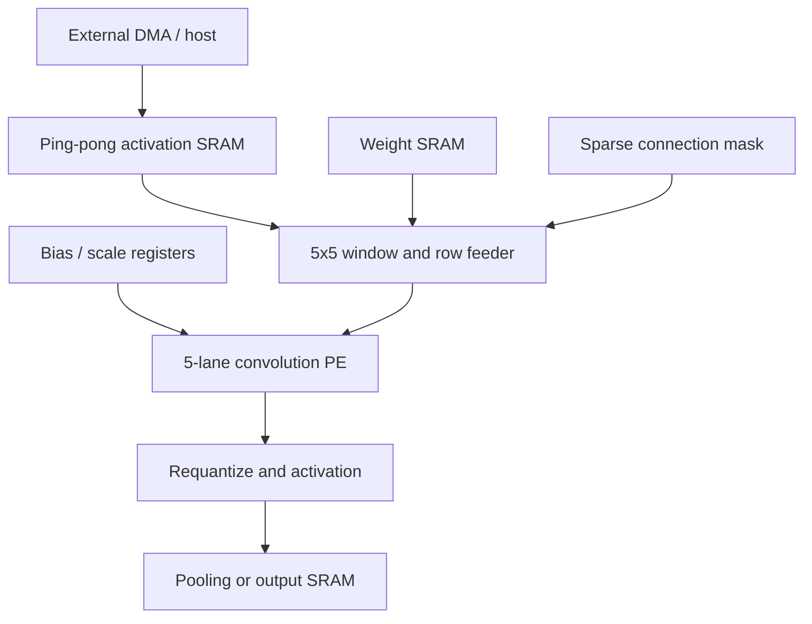
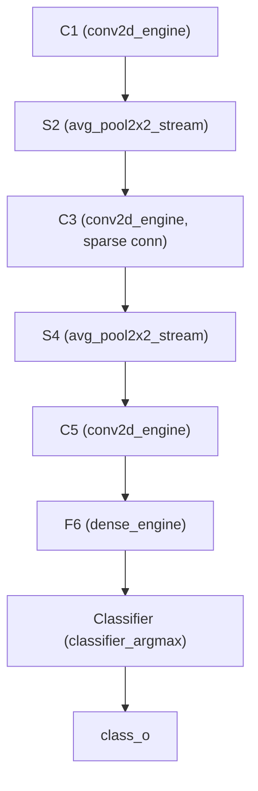

# Architecture

## 1. Canonical LeNet-5 baseline

The attached 1998 paper defines a 32x32 input and seven trainable layers (the
input is not counted). The parameter total below is exactly 60,000; the output
RBF codes are fixed in the original formulation.

| Stage | Operation | Output | Trainable parameters |
|---|---|---:|---:|
| Input | normalized grayscale image | 1x32x32 | 0 |
| C1 | 6 valid 5x5 convolutions | 6x28x28 | 156 |
| S2 | per-map 2x2 subsampling | 6x14x14 | 12 |
| C3 | 16 valid 5x5 convolutions, sparse across S2 maps | 16x10x10 | 1,516 |
| S4 | per-map 2x2 subsampling | 16x5x5 | 32 |
| C5 | 120 valid 5x5 convolutions across all 16 maps | 120x1x1 | 48,120 |
| F6 | fully connected, scaled tanh | 84 | 10,164 |
| Output | 10 Euclidean RBF distances | 10 | fixed codes |

C3 has 60 input-map/output-map connections, not 16x6=96. The first six
outputs connect to three maps each, the next six to four contiguous maps, the
next three to four discontinuous maps, and the last to all six. Both the Python
and RTL tables assert a total of 60.

This table describes the **canonical paper model** (`golden/lenet5.py`), kept
unmodified as a reference: scaled-tanh activation, trainable S2/S4
subsampling, and a Euclidean-RBF output. The RTL implements a separate,
simpler **int8 deployment model** instead -- ReLU activation, fixed (not
trainable) 2x2 average pooling for S2/S4, and an int8 dense(84->10)+argmax
classifier in place of RBF. See Section 7.

## 2. Proposed ASIC partition

The reusable physical-design block is `conv5x5_pe`. The simulation-oriented
`conv2d_engine` combines storage, address generation, sparse-channel skipping,
and output sequencing. Splitting the PE from SRAM makes memory compilation,
banking, and floorplanning technology-specific without changing the arithmetic
contract.

`lenet5_top` sequences the full deployment-model pipeline by resource-sharing
these blocks across every layer that needs them:

One `conv2d_engine` instance runs C1, C3, and C5 in turn; one
`avg_pool2x2_stream` instance runs S2 and S4; one `dense_engine` runs F6; one
`classifier_argmax` (with its own internal `dense_engine`) produces the final
class. Each arrow is a direct streaming bridge (no intermediate buffer stage)
from the upstream engine's output port into the downstream engine's
`load_act_*` port, active only while the upstream engine runs -- see
`docs/INTERFACES.md`'s `lenet5_top` section for the addressing detail.

## 3. Dataflow

The PE uses five parallel signed multipliers. Each accepted cycle evaluates one
kernel row:

`row_sum = Σ(kx=0..4) activation[kx] * weight[kx]`

Five accepted cycles cover one 5x5 input-channel kernel. The accumulator stays
stationary for the complete output pixel while the feeder advances kernel rows
and input channels. `first_i` injects the output-channel bias, and `last_i`
causes int32-to-int8 requantization.

This dataflow was selected because it:

- reuses the partial sum locally;
- needs five multipliers instead of 25;
- maps naturally to five-bank row delivery or a 40-bit SRAM word;
- skips disabled C3 channel pairs before arithmetic;
- keeps the PE independent of the chosen SRAM compiler.

## 4. Fixed-point contract

| Quantity | Format |
|---|---|
| Activation | signed int8 |
| Weight | signed int8 |
| Product | signed int16 |
| Row sum | signed int32 |
| Pixel accumulator and bias | signed int32 |
| Requantized output | signed int8 |

The output equation is:

`y = sat_int8(activation(round_away_from_zero(acc / 2^shift)))`

`activation` is identity or ReLU. The shift is configured per layer. A
production quantization flow should determine each layer's scale and bias
conversion from calibration data; the RTL deliberately avoids embedding
unverified scale constants.

The worst canonical convolution accumulation with full-scale int8 operands is
C5. The bound must be taken over `[-128, 127]`, not `[-127, 127]`: the largest
magnitude an int8 product can reach is `(-128) * (-128) = 16,384`, which is
larger than `127 * 127 = 16,129`, because -128 has no positive counterpart.

`16 * 25 * 128 * 128 = 6,553,600`

F6's worst case is `120 * 128 * 128 = 1,966,080` and the classifier's is
`84 * 128 * 128 = 1,376,256`. All three are well inside signed int32's
2,147,483,647 -- a 327x margin on C5 -- leaving substantial bias headroom.

Two qualifications on "cannot overflow". It is a statement about the
*products*: the accumulator holds `sum(a*w) + bias` and `bias` is a full int32,
so a large enough bias overflows regardless; the products alone cannot. And
until 2026-08-15 it was a bound and nothing else, since no vector drove -128 or
+127 at any operand position. `tb_extremes.sv` now drives exactly these
operands at C5's shape and measures a peak of 7,502,600 (products plus a
deliberately large bias) with the output still bit-exact against the golden
model.

`dense_engine`/`classifier_argmax` reuse `ACC_WIDTH=32` unchanged from
`conv2d_engine`, and `classifier_argmax` compares this raw pre-shift
accumulator directly (via `dense_engine`'s `out_acc_o`) rather than the
shift/ReLU/saturate output, avoiding saturation-induced misclassification --
see `docs/INTERFACES.md`'s Classifier section for why.

## 5. Nominal compute cost

| Layer | Connected 5x5 kernels evaluated | MACs | PE row cycles |
|---|---:|---:|---:|
| C1 | 4,704 | 117,600 | 23,520 |
| C3 | 6,000 | 150,000 | 30,000 |
| C5 | 1,920 | 48,000 | 9,600 |
| Total | 12,624 | 315,600 | 63,120 |

The reference engine adds one non-overlapped output-transfer cycle for each
convolution result (6,424 cycles), giving approximately 69,544 cycles for all
three convolution layers when no output stalls occur. At 100 MHz this is about
0.696 ms, excluding pooling, F6/RBF, layer reloads, and DMA. A production feeder
can overlap accepted outputs with preparation of the next window.

`avg_pool2x2_stream` (S2/S4) uses a one-cycle latch plus one-cycle minimum
hold per output pixel: roughly 2,352 cycles for S2 (6x14x14 outputs) and 800
for S4 (16x5x5 outputs). `dense_engine`'s default `LANES=8` datapath takes
`ceil(in_len/8)` cycles per output neuron: F6 (120->84) is about 1,260 cycles,
the classifier (84->10) about 110. None of these controllers are pipelined
across outputs -- consistent with `conv2d_engine`'s own one-row-per-cycle,
non-overlapped posture.

`lenet5_top` measured end to end (ModelSim, full canonical 32x32x1 input,
including every per-layer weight/bias/connectivity ROM load): **209,290
cycles** (2,092,900 ns at 100 MHz, about 2.09 ms), dominated by the C5 weight
load (48,000 words) and the C1/C3 convolution compute.

That figure is the **cold path**: the host writing all 62,730 ROM words
followed by one inference. The **steady-state** cost of an inference with the
ROMs already resident, measured `start_i` to `done_o`, is **146,544 cycles**
(1.47 ms at 100 MHz) -- the number that matters for a device streaming images
rather than being programmed once per picture. `tb_lenet5_top` measures both,
runs the accelerator twice back to back without a reset, and fails the
regression if either the absolute count moves or the second run costs a
different number of cycles than the first. This is a
verification-oriented, resource-shared, non-overlapped sequencing baseline,
not a throughput target -- overlapping ROM loads with the previous stage's
compute, and pipelining the pooling/dense controllers, are the obvious first
optimizations for a production feeder.

## 6. On-chip memory estimate

Byte counts assume int8 activations/weights and one layer resident at a time.

| Item | Peak payload |
|---|---:|
| Input activation tensor | 16x32x32 = 16 KiB provisioned maximum |
| Largest canonical weight tensor (C5) | 120x16x5x5 = 48,000 B |
| F6 weight tensor | 84x120 = 10,080 B |
| Classifier weight tensor | 10x84 = 840 B |
| Largest convolution output (C1) | 6x28x28 = 4,704 B |
| Biases | 120x4 = 480 B |
| Connection mask | 120x16 bits = 240 B provisioned maximum |

`lenet5_top` currently keeps one persistent ROM per layer (image, then a
weight+bias pair per layer) simultaneously, sized to the figures above --
about 61.5 KB total -- since it is a verification integration, not an
SRAM-banked design. A production top level would stream weights per layer
from a single shared bank instead of holding all of them resident at once.

A practical macro plan uses separate weight SRAM and two activation banks so
one tensor can be produced while the next is consumed. Exact banking depends
on the compiler's word width and port choices.

## 7. Original versus deployment model

The canonical NumPy model (`golden/lenet5.py`, `forward_canonical`) is the
architectural reference for the 1998 paper. The int8 RTL is the hardware
reference, and its own bit-exact Python counterpart is
`golden/deploy.py:deploy_forward_int8` -- a second, separate orchestrator
(alongside `golden/quantized_conv.py`'s per-operator kernels) that chains the
RTL's actual design choices end to end:

- untrained, deterministic weights/biases (`random_deploy_parameters`,
  matching `conv2d_engine`/`generate_vectors.py`'s existing "deterministic
  random, not trained" convention -- trained-weight sourcing is still open,
  same as the canonical model);
- a fixed per-layer shift (`DEFAULT_SHIFTS`, currently 7 for C1/C3/C5/F6),
  not yet a calibrated quantization/export step;
- **ReLU**, not scaled tanh, after every stage;
- **fixed** (non-trainable) 2x2 average pooling for S2/S4, not the paper's
  trainable-coefficient subsample;
- an **int8 dense(84->10) + argmax** output classifier, not the paper's RBF/
  Euclidean-distance layer.

`tb_lenet5_top.sv` checks `rtl/lenet5_top.sv` against `deploy_forward_int8`
directly, so this is the model to extend if the RTL's quantization or
classifier choice ever changes. `forward_canonical` remains untouched as the
paper reference; the two models are deliberately not required to agree with
each other. Still open for a real deployable classifier: trained weights,
per-layer calibrated scales (rather than a fixed shift=7), and a decision on
whether ReLU/dense+argmax should be revisited once real accuracy numbers are
available.

